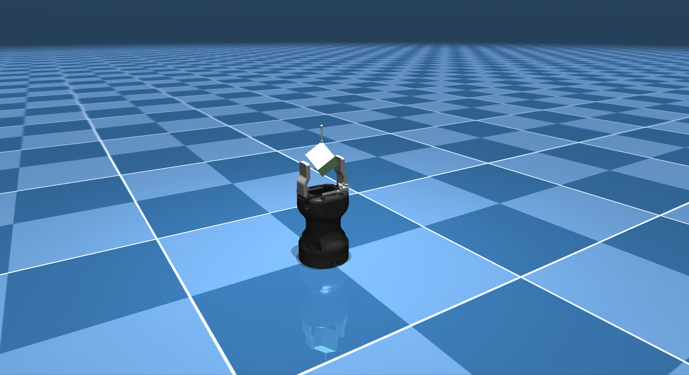

# Robotiq Hande-E Description (MJCF)

Requires MuJoCo 2.2.2 or later.

## Overview

This package contains a simplified robot description (MJCF) of the [Robotiq Hand-E](https://robotiq.com/products/hand-e-adaptive-robot-gripper) developed
by [Robotiq](https://robotiq.com/). It is derived from the [publicly available
URDF
description](https://github.com/cambel/robotiq/blob/noetic-devel/robotiq_description/urdf/robotiq_hand_e.urdf).

  

## URDF → MJCF derivation steps

This MJCF file was generated from the MuJoCo compile binary, which has transformed [the URDF file](https://github.com/cambel/robotiq/blob/noetic-devel/robotiq_description/urdf/robotiq_hand_e.urdf) into MJCF, with additional changes made to the `gainprm` parameter.

## License

This model is released under a [BSD-2-Clause License](LICENSE).
